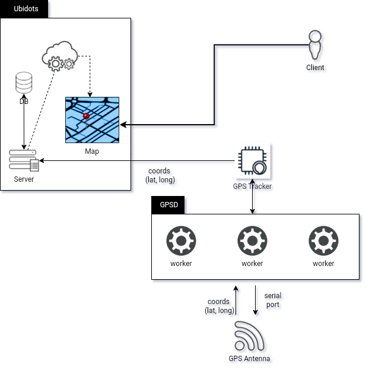

# GPS Tracker

## Mode of Operation

After startup, the program (`main.py`) is launched immediately. Upon launch, gps-tracker communicates with the GPS daemon ([GPSd](https://en.m.wikipedia.org/wiki/Gpsd)), which manages the connection between our program and the GPS antenna by providing an interface which gps-tracker can consume). Through this interface provided by [GPSd](https://en.m.wikipedia.org/wiki/Gpsd), our program can have access to a steady stream of 2 dimensional coordinates (latitude and longitude), which is then passed to [Ubidots](https://ubidots.com/) for the construction of a map that can be used to determine the location of the tracker.

